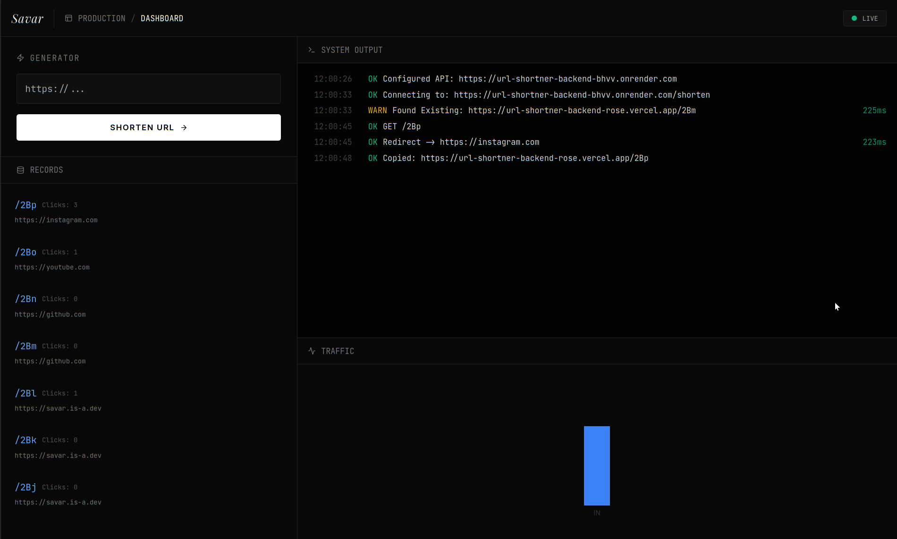

### **URL Shortener**

A full-stack high performant URL shortener built to demonstrate scalable, production-ready system architecture. This project mimics services like Bit.ly by implementing advanced caching patterns and a modern serverless stack.

**Key Features:**

* **Optimized Performance:** Uses **Upstash (Redis)** for high-speed caching (Cache-Aside pattern) to serve redirects in milliseconds, minimizing database hits.
* **Scalable Storage:** Powered by **Neon (Serverless PostgreSQL)** to handle persistent data with auto-scaling capabilities.
* **Collision-Free Algorithm:** Implements **Base62 encoding** to convert Database IDs into unique short strings.
* **Asynchronous Analytics:** Tracks geolocation and click stats using background tasks, ensuring the user redirect is never blocked.
* **Developer Dashboard:** A responsive React UI featuring live system telemetry, real-time traffic charts, and a developer-centric dark mode.

**Tech Stack:**

* **Backend:** Python (FastAPI), SQLAlchemy
* **Frontend:** React, Tailwind CSS, Recharts
* **Data Layer:** **Neon** (Serverless Postgres), **Upstash** (Serverless Redis)
* **Deployment:** Render (API), Vercel (Frontend)

## Preview
[Here](https://url-shortner-backend-rose.vercel.app/)'s a live link  

